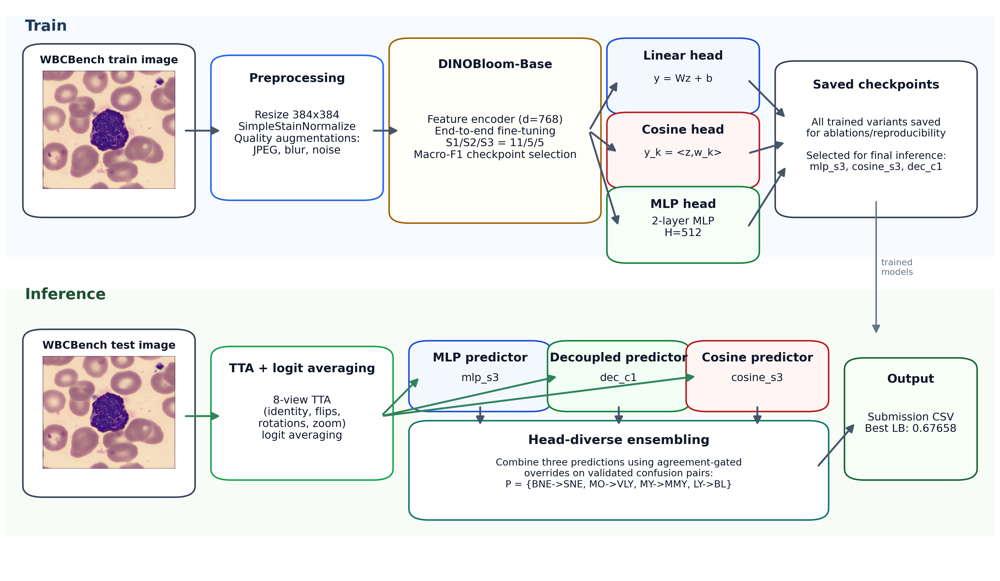

# MSFiT (Multi-Stage Fine-Tuning)

Multi-Stage Fine-Tuning of Pathology Foundation Models with Head-Diverse Ensembling for White Blood Cell Classification.


## Method Overview



Published `0.67658` submission path: `dinobloom_base + mlp` anchor (`mlp_s3`), `dinobloom_base + cosine` advisor (`cosine_s3`), and a frozen-backbone decoupled `dinobloom_base + mlp` advisor (`dec_c1`), combined with conservative confusion-pair overrides. The linear-head branch shown in the training block is part of the broader framework, not part of the final published hybrid.

## Layout

```text
msfit/
  README.md
  assets/
    system_architecture_best_method.png
  submissions/
    submission_dinobloom_v4_mlp_s3_tta.csv
    submission_dinobloom_v4_linear_s3_tta.csv
    submission_dec_bestlb_cls_c1_wbcc_tta.csv
    submission_dinobloom_v4_cosine_s3_tta.csv
    submission_mlp_anchor_r2_c1cos_pospair.csv
  reproduce_best_submission.sh
  modeling.py
  train.py
  inference.py
  requirements.txt
  scripts/
    build_conservative_hybrid_submission.py
```

## What It Reproduces

- Best confirmed leaderboard submission: `0.67658` macro-F1
- Method: MLP anchor + cosine advisor + decoupled `c1` advisor + conservative confusion-pair overrides

In plain terms:

- `MLP anchor`: the default prediction used for the final submission. It is a `dinobloom_base` model with an `mlp` head, trained by full fine-tuning over 3 stages.
- `Cosine advisor`: a second-opinion model used only for conservative overrides. It is a `dinobloom_base` model with a `cosine` head, also trained by full fine-tuning over 3 stages.
- `Decoupled c1 advisor`: another second-opinion model used only for conservative overrides. It reuses the `dinobloom_base` backbone from the final MLP checkpoint, freezes that backbone, and trains a fresh `mlp` head only.
- Final rule: keep the anchor prediction unless `c1` and cosine agree on an allowed confusion-pair change: `BNE->SNE`, `MO->VLY`, `MY->MMY`, or `LY->BL`.

## Published Results

| Component | Role | Training setup | Eval macro-F1 | Leaderboard |
|---|---|---|---:|---:|
| `dinobloom_v4_mlp_s3 + TTA` | Anchor | `dinobloom_base + mlp`, full fine-tuning, S1->S2->S3 | 0.7210 | 0.67584 |
| `dinobloom_v4_linear_s3 + TTA` | Linear reference | `dinobloom_base + linear`, full fine-tuning, S1->S2->S3 | 0.7210 | 0.66870 |
| `dec_bestlb_cls_c1_wbcc + TTA` | Advisor 1 | `dinobloom_base + mlp`, frozen backbone, head-only fine-tuning | 0.7212 | 0.67540 |
| `dinobloom_v4_cosine_s3 + TTA` | Advisor 2 | `dinobloom_base + cosine`, full fine-tuning, S1->S2->S3 | 0.7264 | 0.66085 |
| `submission_mlp_anchor_r2_c1cos_pospair` | Final hybrid | Anchor plus conservative advisor agreement overrides | 0.7217 | **0.67658** |

Reference submission CSVs for these rows are included in `msfit/submissions/`.

And model checkpoints of the Anchor can be found on Hugging Face - https://huggingface.co/AntonyG/msfit-dinobloom-v4-mlp-s3

## Head Specialization

Examples from eval showing why head diversity was useful. For `MLP`, `linear`, and `cosine`, the table shows the best score within that head family on eval with TTA. `dec_c1` is shown separately because it is a frozen-backbone decoupled classifier rather than part of the main head-family sweep.

| Class | Best MLP | Best linear | Best cosine | Winner |
|---|---|---|---:|---|
| `BNE` | 0.448 | 0.434 | 0.470 | Cosine |
| `MMY` | 0.538 | 0.585 | 0.556 | Linear |
| `VLY` | 0.626 | 0.648 | 0.633 | Linear |
| `PMY` | 0.733 | 0.656 | 0.636  | MLP |
| `PC` | 0.787 | 0.807 | 0.792 | Linear |

## Install

```bash
pip install -r msfit/requirements.txt
```

Requirements:

- Python 3.10+
- PyTorch 2.x with CUDA
- `timm>=1.0`
- WBCBench 2026 dataset from the challenge organizers
- Internet access or cached Hugging Face weights for DINOBloom (and other models)

## Supported Backbones

The framework supports **any timm-compatible model**, not just DINOBloom:

| Backbone | Type | Params | Pretrained On |
|---|---|---|---|
| `dinobloom_base` | ViT-B/14 | 86M | Hematology (blood + bone marrow) |
| `dinobloom_large` | ViT-L/14 | 307M | Hematology |
| `dinobloom_giant` | ViT-g/14 | 1.1B | Hematology |
| `uni2-h` | ViT-g/14 | 1.5B | General pathology (WSI) |
| `virchow2` | ViT-H/14 | 632M | Tumor pathology (H&E) |
| `maxvit_base_tf_384.in21k_ft_in1k` | MaxViT (hybrid) | 119M | ImageNet-21K |
| `convnextv2_large.fcmae_ft_in22k_in1k_384` | ConvNeXt V2 | 198M | ImageNet-22K |
| Any timm model name | varies | varies | varies |

## Reproduce The Submission

This command writes into a fresh run folder under `code_reproduction/` and refuses to overwrite an existing folder:

```bash
RUN_NAME="repro_baseline_nondet_v1"
nohup bash msfit/reproduce_best_submission.sh \
  --data-root /mnt/c/Users/amg/Downloads/wbcc-2026-main/wbc-bench-2026-data \
  --python ./venv/bin/python \
  --run-name "$RUN_NAME" \
  > "code_reproduction/${RUN_NAME}.nohup.log" 2>&1 &
echo "$RUN_NAME"
```

Monitor the run with:

```bash
tail -f "code_reproduction/${RUN_NAME}.nohup.log"
```

## Single-Model Commands

If you want one-command training for the main published branches without running the full hybrid reproduction, use the scripts in [`experiments/`](./experiments):

```bash
bash msfit/experiments/train_mlp.sh --data-root /path/to/wbcbench-2026-data
bash msfit/experiments/train_linear.sh --data-root /path/to/wbcbench-2026-data
bash msfit/experiments/train_cosine.sh --data-root /path/to/wbcbench-2026-data
bash msfit/experiments/train_decoupled_c1.sh \
  --data-root /path/to/wbcbench-2026-data \
  --checkpoint /path/to/dinobloom_v4_mlp_s3/best.pth
```

These wrappers create fresh run directories under `code_reproduction/` and keep the published stage schedules for each branch.

## Method Summary

1. **Backbone in the best setup:** `dinobloom_base`
2. **Anchor model:** `dinobloom_base + mlp head`, full fine-tuning for `11 -> 5 -> 5` epochs
3. **Advisor model 1:** `dinobloom_base + cosine head`, full fine-tuning for `11 -> 5 -> 5` epochs
4. **Advisor model 2 (`c1`):** `dinobloom_base + mlp head`, backbone frozen, head-only fine-tuning for `8` epochs from the final MLP checkpoint
5. **Losses:** focal loss for anchor/cosine, cross-entropy for `c1`
6. **Training details:** label smoothing, rare-class-protected MixUp/CutMix, OneCycleLR, AMP, TTA=8 at inference
7. **Final submission rule:** start from the anchor prediction and override only when both advisors agree on one of four allowed confusion-pair transitions

Outputs:

- `OUT_ROOT/RUN_NAME/submission_best_reproduced.csv`
- `OUT_ROOT/RUN_NAME/repro_metadata.txt`
- `OUT_ROOT/RUN_NAME/*.log`
- `OUT_ROOT/RUN_NAME/*/best.pth`
- `OUT_ROOT/RUN_NAME/preds_*_test/`


## Notes

- `train.py` still supports more than the winning recipe, but the README only documents the published path.
- `inference.py` supports eval/test inference, TTA, logit export, and threshold/bias utilities.
- If you want a slower, more repeatable rerun, pass `--deterministic 1` to the reproduction script.

Like this:

```bash
RUN_NAME="repro_baseline_det_v1"
nohup bash msfit/reproduce_best_submission.sh \
  --data-root /mnt/c/Users/amg/Downloads/wbcc-2026-main/wbc-bench-2026-data \
  --python ./venv/bin/python \
  --run-name "$RUN_NAME" \
  --deterministic 1 \
  > "code_reproduction/${RUN_NAME}.nohup.log" 2>&1 &
```

## Citation

```
@inproceedings{Gitau2026ISBI,
  author    = {Antony Gitau and Martin Paulson and Bjørn-Jostein Singstad and Karl Thomas Hjelmervik and Ola Marius Lysaker and Veralia Gabriela Sanchez},
  title     = {Multi-Stage Fine-Tuning of Pathology Foundation Models with Head-Diverse Ensembling for White Blood Cell Classification},
  booktitle = {2026 IEEE 23rd International Symposium on Biomedical Imaging (ISBI)},
  year      = {2026},
  organization = {IEEE}
}
```
